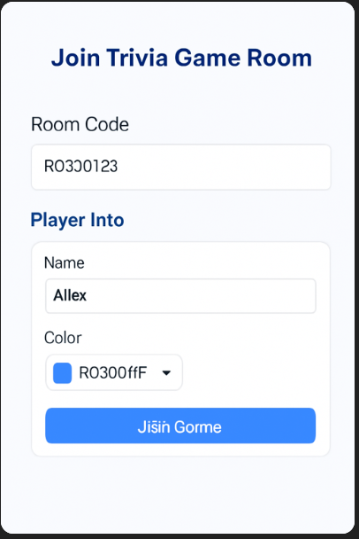
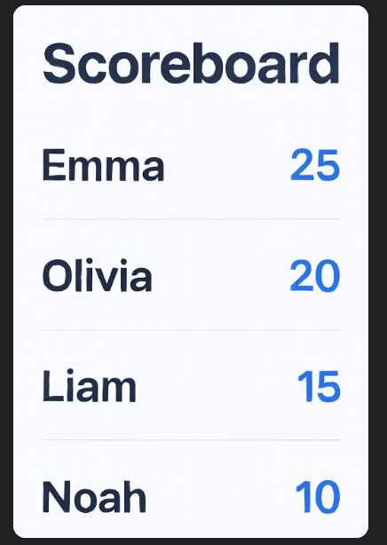
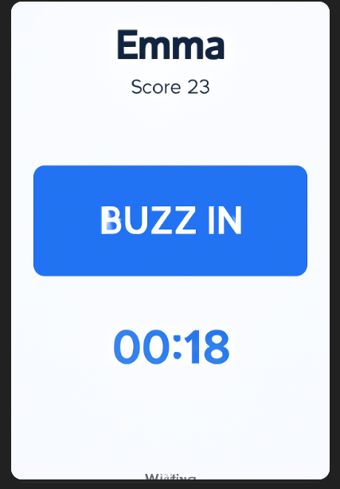
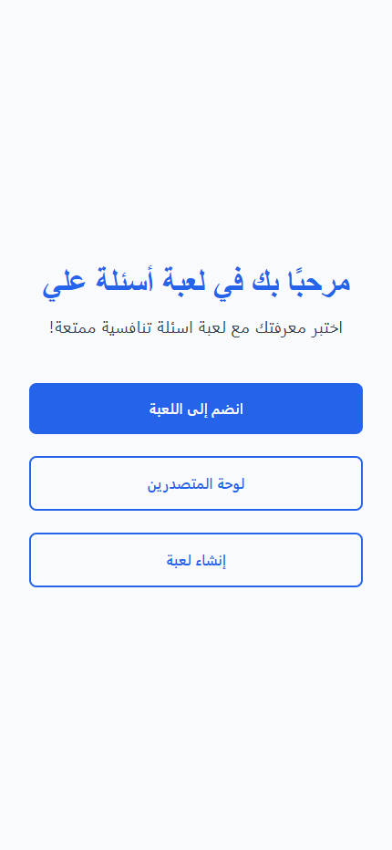
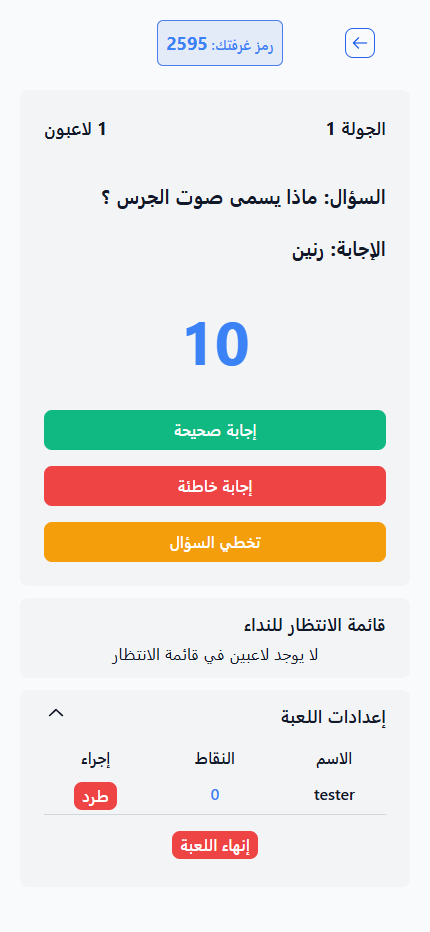
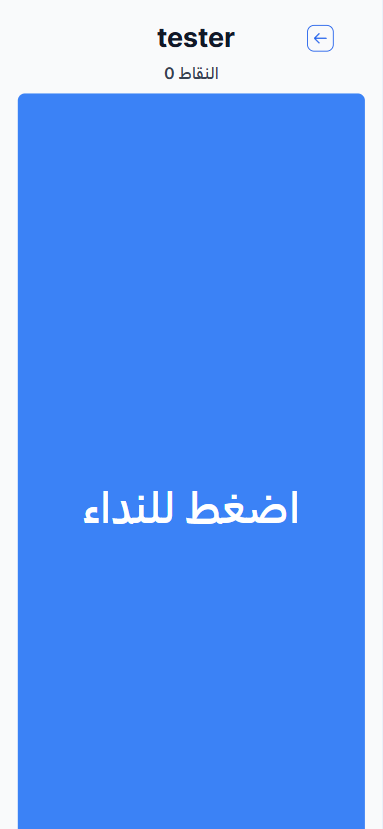
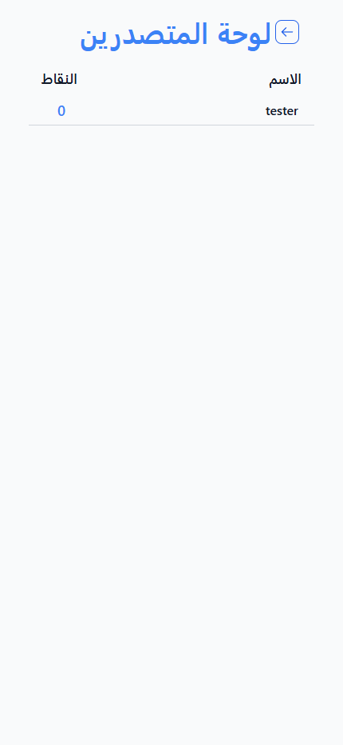

# Ali Trivia





A real-time trivia game platform built with Next.js. Challenge your friends or play solo, with support for multiple languages and real-time gameplay.

---

## Features
- Real-time multiplayer trivia
- Arabic and English language support
- Live leaderboards
- Room-based game sessions
- Admin controls for game management
- Responsive UI for desktop and mobile

## Getting Started

1. **Clone the repository:**
   ```bash
   git clone https://github.com/yourusername/ali-trivia.git
   cd ali-trivia
   ```
2. **Install dependencies:**
   ```bash
   npm install
   # or
   yarn install
   ```
3. **Set up environment variables:**
   - Copy `example.env.local` to `.env.local` and fill in the required values.
4. **Run the development server:**
   ```bash
   npm run dev
   # or
   yarn dev
   ```
5. Open [http://localhost:3000](http://localhost:3000) in your browser.

## Demo






## Contributing

Contributions are welcome! Please follow the standard GitHub workflow:

1. Fork the repository
2. Create a new branch (`git checkout -b feature/your-feature`)
3. Commit your changes
4. Push to your fork and submit a pull request

Please be respectful and follow the [Contributor Covenant Code of Conduct](https://www.contributor-covenant.org/version/2/1/code_of_conduct/).

## License

This project is licensed under the MIT License. See the [LICENSE](LICENSE) file for details.

## Author

Created by **Ali Alwahayb**

---

## Acknowledgements
- [Next.js](https://nextjs.org/)
- [Vercel](https://vercel.com/)
- [Pusher](https://pusher.com/)

---

For any questions or feedback, feel free to open an issue.
